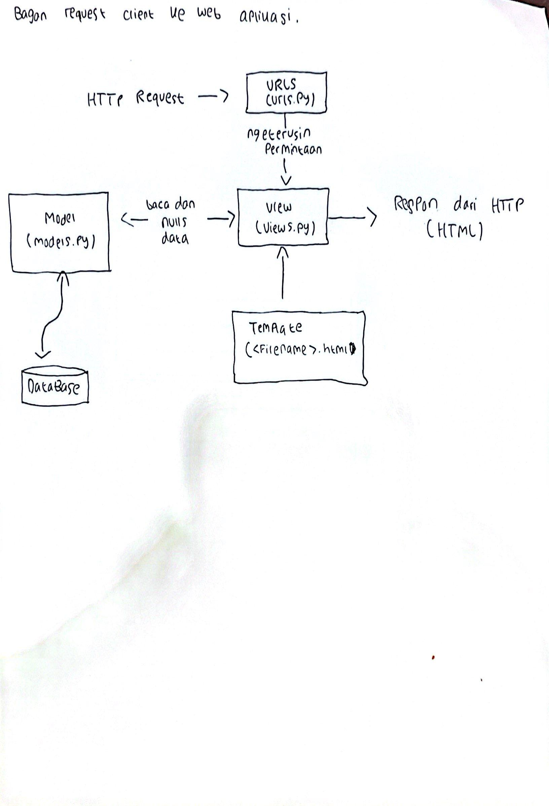
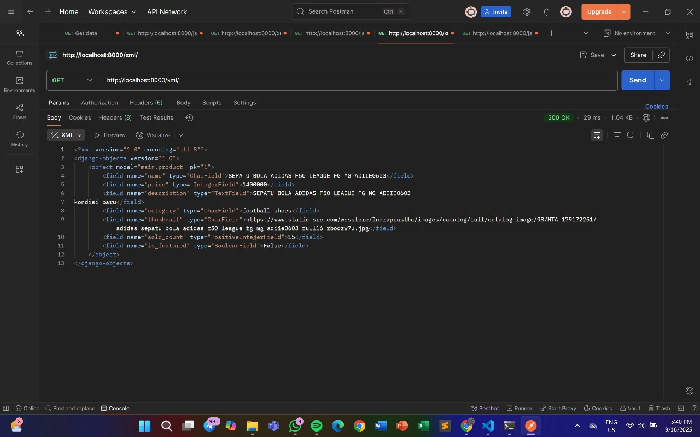
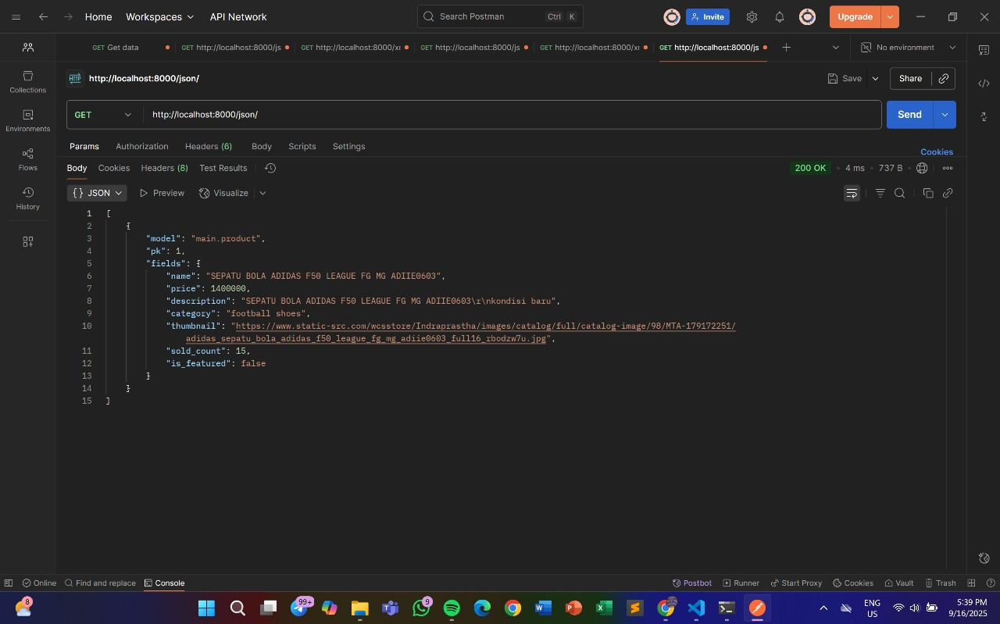
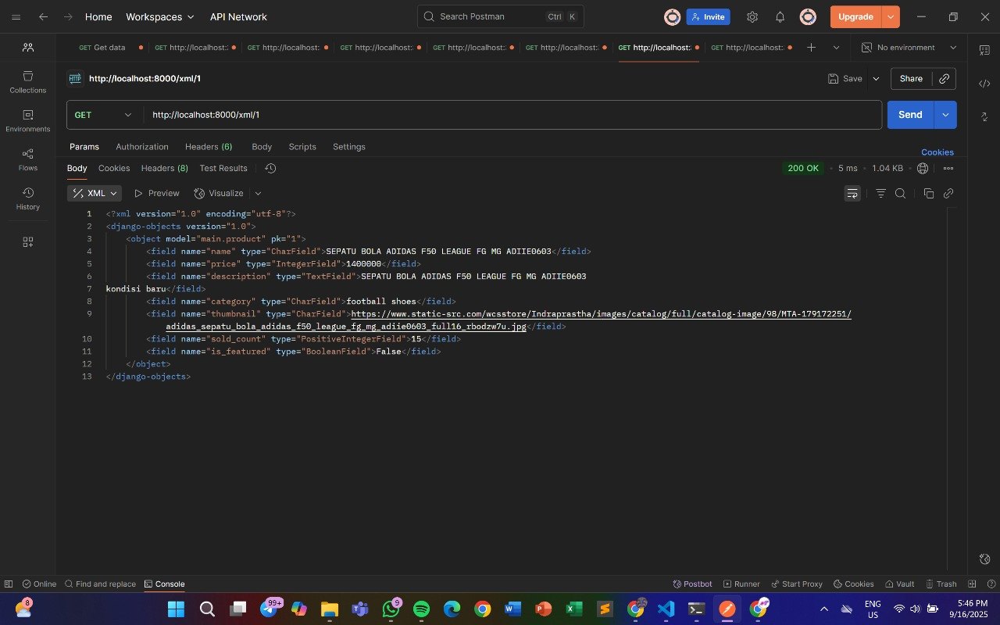
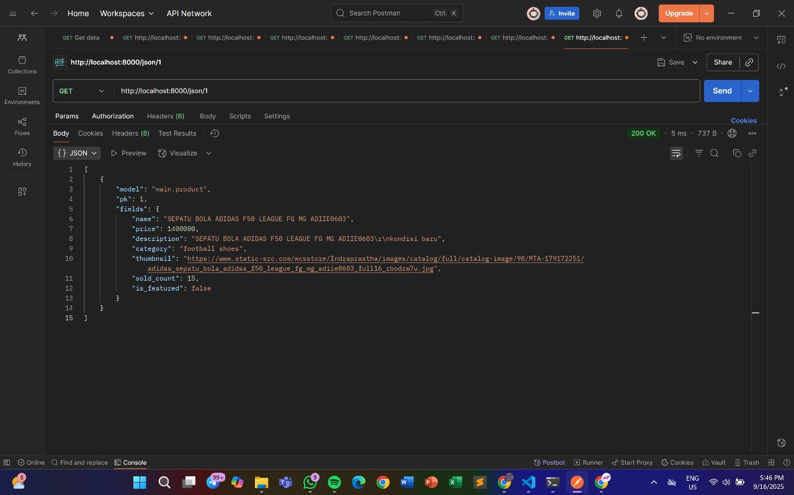

project di pws: https://muhammad-fadhil43-fajarwearshop.pbp.cs.ui.ac.id/

Tugas 2:
1. Jelaskan bagaimana cara kamu mengimplementasikan checklist di atas secara step-by-step (bukan hanya sekadar mengikuti tutorial).
= tahap awal yang saya lakukan adalah dimulai dari tutorial 0, yaitu dengan instalasi Django dan inisiasi Django, karena ini perlu dikarenakan dalam proyek ini saya memakai Django, dengan menggunakan python -m venv env lalu env\Scripts\activate, dan jangan lupa untuk membuat file txt bernama requirements.txt dengan ada beberapa isi nya seperti di tutorial, dan tidak lupa untuk setting databse name, host, port, user, password, schema, dan productionnya, di tutorial 0 ini saya agak sedikit kesulitan di pws nya karena nama dari repository saya ada huruf besarnya. Setelah saya membuat sebuah proyek Django yang baru untuk tugas kali ini, saya lanjut ke Membuat aplikasi dengan nama main pada proyek tersebut dengan cara jalanin perintah python manage.py startapp main, ini bakalan ngebentuk folder baru bernama main di folder proyek tadi. Dan juga tidak lupa menaruh main itu di installed Apps yang ada di settings.py, karena settings.py ini bisa dikatakan pusat semua konfigurasinya ada disini. Dan juga membuat template untuk proyek saya dengan tipe file html, dan mengubah models.py, disini untuk kategorinya di proyek saya ada futsal shoes, footbal shoes, dan socks, karena FajarWearShop rencanannya sebagai toko menjual sepatu untuk olahraga bola kaki. Kemudian yang diperlukan di models.py adalah nama, harga, deskripsi, kategori, thumbnail, sold_count, is_feature, dan di models.py ini saya punya fungsi yaitu def __str_(self), yang dimana untuk mengembalikan nama saya, dan def ifbesstsller, jika kategori produk itu terjual lebih dari 50 kali dia termasuk produk yang bestseller, dan def yang terakhir adalah increment_sales(self), untuk ketika ada pembelian, hitung jumlah terjual produk tersebut. Kemudia di makemigration dan di migrate karena saya telah mengubah file models.py ini bersifat wajib setiap kali ada perubahan. Kemudian saya melakukan routing di urls.py untuk mengirim informasi permintaan web server dari client, dan saya tidak melakukan Django test karena belum perlu pada saat kali ini, kemudia saya melakukan commit dan push semua pekerjaan saya ke daalam repository github saya.s

2. Buatlah bagan yang berisi request client ke web aplikasi berbasis Django beserta responnya dan jelaskan pada bagan tersebut kaitan antara urls.py, views.py, models.py, dan berkas html.
= 

3. Jelaskan peran settings.py dalam proyek Django!
= di dalam proyek Django, setting.py berperan sebagai wadah konfigurasi semua pengaturan atau set up setup pada aplikasi kita, jadi pas proyek Django dijalanin pakai env, Django bakalan membaca file settings.py itu seperti alur aplikasinya gimana. Dan juga settings.py ini bisa dikatakan sebagai otak nya Django, karena kalau mau ubah apapun, harus ada perubahan pada file settings.py ini.

4. Bagaimana cara kerja migrasi database di Django?
= migrasi database di Django seperti memori atau stack, jadi semisal kita merubah file models.py dia akan mencatat dan setelah kita merubah atau memodifikasi file models.py kita diwajibkan untuk menjalankan make migration dan juga migrate, jika tidak dijalankan perubahan yang dibuat di models.py tidak akan dikirim ke databasenya.

5. Menurut Anda, dari semua framework yang ada, mengapa framework Django dijadikan permulaan pembelajaran pengembangan perangkat lunak?
= menurut saya karena di Django kita sudah langsung dapat banyak template dan framework-framework lainnya, yang dimana ini memudahkan saya dan yang lain untuk belajar platform melali Django, dan juga Django mempunyai dokumentasi yang lengkap dan jelas sehingga memudahkan saya untuk belajar dan terus memahami jikalau saya bingung saya bukak Django documentation di Chrome.

6. Apakah ada feedback untuk asisten dosen tutorial 1 yang telah kamu kerjakan sebelumnya?
= feedback untuk asdos tutorial 1 cukup baik di discord ketika ada yang menanyakan langsung dijawab oleh asdos asdos, keren asdosnyaa.....

--------------------------------------------------------------------------------------------------------------------------------------------------------------------------------------------------------------------------------------

Tugas 3:
 1. Jelaskan mengapa kita memerlukan data delivery dalam pengimplementasian sebuah platform?
 = karena kita memerlukan data delivery dalam pemngimplementasian sebuah platform karena data itu merupakan inti dari setiap proses yang terjadi di dalamnya. Jika transformasi datanya baik maka nantinya code code dan program kita akan berjalan lancar dikarenkan data-data yang kita udah buat terkirim dengan baik dan tidak ada error di dalamnya, sebaliknya jika data datanya tidak terdelivery dengan baik, maka request requestnya akan tidak terpenuhi dan akan menyebabkan error pada proyek kita.

 2. Menurutmu, mana yang lebih baik antara XML dan JSON? Mengapa JSON lebih populer dibandingkan XML?
 =  yang lebih baik menurut saya adalah JSON, dikarenakan strukturnya yang lebih ringkas, mudah dibaca, dan cepat diproses oleh komputer. JSON cukup pakai kurung kurawal atau kurung siku sehingga lebih singkat dan tidak boros. JSON juga menurut saya lebih cepat diproses komputer dan langsung didukung oleh JavaScript, jadi lebih praktis dipakai di web maupun aplikasi. Karena ringan dan mudah diintegrasikan dengan berbagai bahasa pemrograman, JSON jadi pilihan utama untuk API modern. Sementara XML masih dipakai di beberapa sistem lama atau kebutuhan khusus, untuk aplikasi masa kini JSON jauh lebih efisien dan nyaman digunakan.

 3. Jelaskan fungsi dari method is_valid() pada form Django dan mengapa kita membutuhkan method tersebut?
 = setau saya, di Django, is_valid() dipakai untuk ngecek apakah data yang terkirim lewat form itu sudah sesuai aturan yang kita tentukan di form atau model. Nantinya, jika hasil booelannya true, maka data-data tersebut itu itu valid, sebaliknya jika hasil dari booelannya itu false, maka nanti Django bakalan nyiapin pesan error biar bisa ditampilin ke user, jadi kita butuh is_valid() supaya data yang masuk ke sistem tetap aman, rapi, dan sesuai aturan, jadi nggak asal masuk ke databsenya, istilah lainnya agar tidak ada data yang salah masuk ke database.

 4. Mengapa kita membutuhkan csrf_token saat membuat form di Django? Apa yang dapat terjadi jika kita tidak menambahkan csrf_token pada form Django? Bagaimana hal tersebut dapat dimanfaatkan oleh penyerang?
 = kita butuh csrf_token di form Django supaya aplikasi tetap aman dari serangan yang namanya CSRF(Cross-Site Request Forgery). Kalau dari form ini tidak pakai csrf_token, orang jahat bisa bikin form palsu di website lain. Misalnya kita lagi login aplikasi, lalu tanpa sadar klik link atau isi form di situs jebakan. karena engga ada perlindungan, server menganggap itu, sebagai request, padahal isinya berbahaya, nah makanya ada yang namanya phising.

 5. Jelaskan bagaimana cara kamu mengimplementasikan checklist di atas secara step-by-step (bukan hanya sekadar mengikuti tutorial).
 = cara saya untuk mengimplementasikan checklistnya ialah yang pertama pertama memang mengikuti tutorial, tetapi sembari mengikuti tutorial itu, saya mempelajari perlakuan perlakuan dari code code proyek saya, saya mengikuti pada tutorial 2, dengan mengubah bagian bagian dari yang namanya news menjadi products yang diamana jika tidak diganti code oodenya tidak bakalan tersambung. Dan juga tidak lupa untuk membuat direktori baru bernaman templates, yang dimana templates ini akan diisin dengan file html yang akan menampilkan Create_product sama product_detail. Dan juga mengubah bagian fields sesuai dengan di models, serta menggunakan xml dan json, dan mengecek apakah data nya terkirim dengan baik di postman, kurang lebih begitu saya dalam mengerjakan tugas 3 kali ini, lumayan ada error nya sedikit dikarenakan lumayan banyak kesalahan penamaan yang tidak sesuai dan menyebabkan error pada proyek saya, tapi overall aman, so far so good.

 6. Apakah ada feedback untuk asdos di tutorial 2 yang sudah kalian kerjakan?
= sangat baik sejauh ini, saya bertanya dan kakak kakak asdos menjawab dengan sangat baik dan ramah, good job untuk asdos dan tim dosen semangatt.

  - Mengakses keempat URL di poin 2 menggunakan Postman, membuat screenshot dari hasil akses URL pada Postman, dan menambahkannya ke dalam README.md.
  
  
  
  
